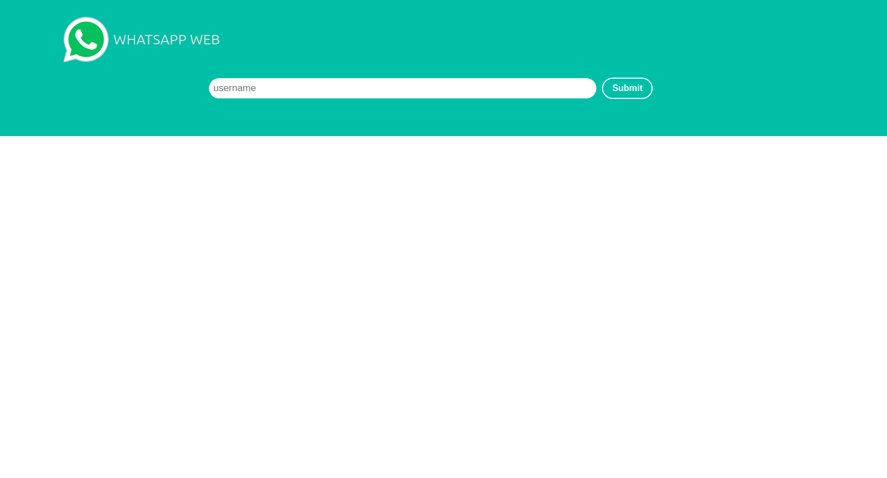
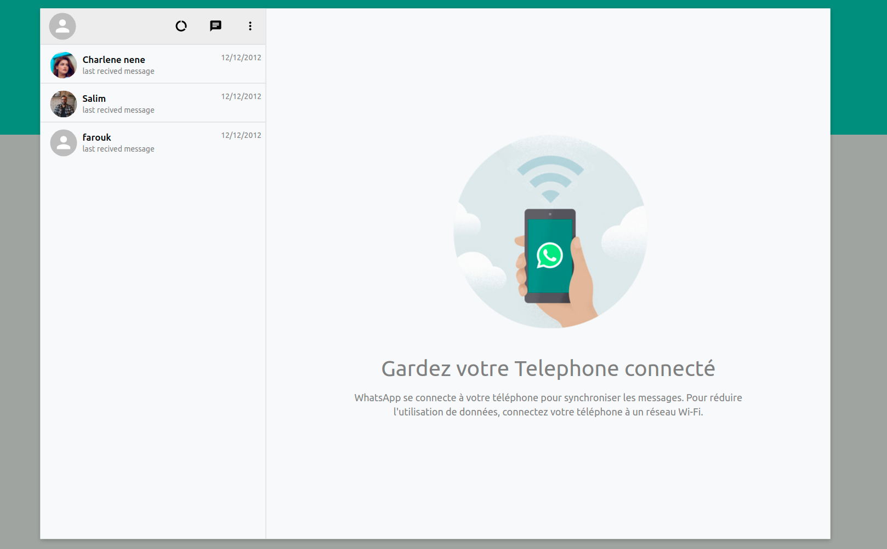
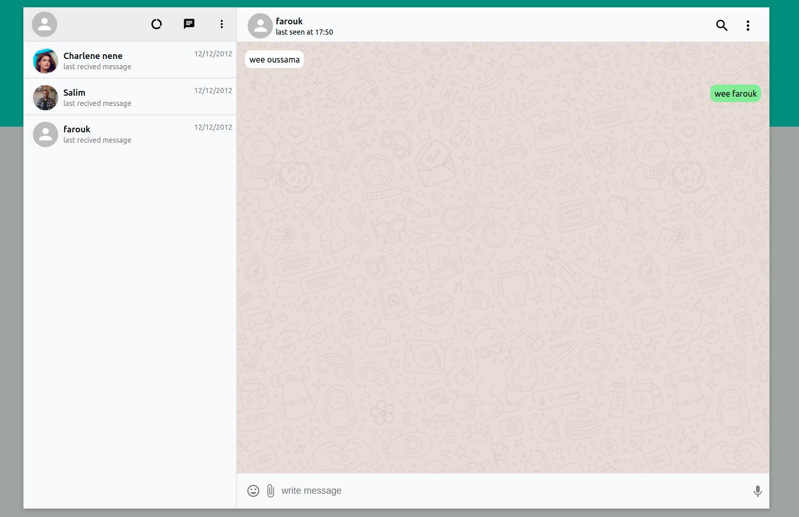

# WhatsApp clone App

## Description:

WhatsApp web clone made with Reactjs

## ScreenShots:

 
 

## Tools & languages:

- vscode (IDE)
- JavaScript (logic)
- Reactjs
- scss

## Contribution:

Feel free to fork this project and add whatever you like. If you have any suggestions or any comments please feel free to contact me or to open an issue.

## links:

https://whatsapp-bf65.onrender.com/ (for testing the app)

https://github.com/oussama-zaoui/chatApp_backend (backend repository link)
